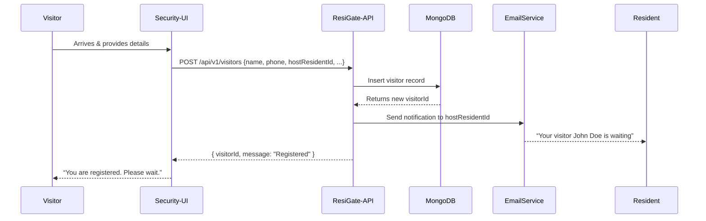

# ResiGate Functional Documentation

> **Version**: 1.0  
> **Last Updated**: June 3, 2025  
> **Target Audience**: Clients, society administrators, security personnel, and technical team members who need to understand overall system behavior and workflows.

---

## 1. Project Overview

ResiGate is a **full-stack visitor management system** designed for residential societies. Its goal is to streamline:

- **Visitor Registration**: Logging visitor details when they arrive.
- **Check-In / Check-Out**: Tracking visitor movement in real-time.
- **Resident Notifications**: Informing residents when their visitors arrive.
- **Resident Management**: Managing resident profiles (apartments, contact info).
- **Security Dashboard**: Allowing security personnel to monitor all visitors at a glance.

### 1.1. Why ResiGate?

- **Security & Transparency**: All visitor data is recorded with timestamps.
- **Ease of Use**: A Next.js frontend provides a responsive UI for security, residents, and admins.
- **Notifications**: Residents get instant alerts via email (and/or push notifications) whenever a visitor is registered or checks in.
- **Role-Based Access**: Admin, Resident, and Security roles ensure separation of duties.

---

## 2. User Roles & Permissions

| Role            | Description                    | Permissions/Access                                                                                   |
|-----------------|-------------------------------|------------------------------------------------------------------------------------------------------|
| **SuperAdmin**  | Platform-level admin           | - Manage all societies<br>- Manage all users<br>- View/manage all data across societies              |
| **SocietyAdmin**| Society administrator          | - Manage residents in their society<br>- View/delete all visitors<br>- Configure society settings<br>- Manage facilities, meetings, notices, vendors, parking, committee members for their society |
| **Owner/Renter**| Resident (homeowner/tenant)    | - View own visitor history<br>- Create/view gate passes<br>- View/manage own profile<br>- Book facilities<br>- Submit/view complaints<br>- View neighbours, vendors, committee members, notices, meetings, parking, payment details |
| **Guard**       | Security personnel             | - Register new visitors<br>- Check in/out visitors<br>- View current day’s visitors<br>- Validate gate pass tokens<br>- Add visitor entry (from gate) |
| **Guest**       | Unauthenticated user           | - Access public landing page (if any)<br>- Public visitor entry (if enabled)                         |

### Detailed Role Capabilities

#### SuperAdmin
- Full access to all societies and their data
- Can create, update, and delete societies
- Can manage all users, including SocietyAdmins
- Can view and audit all logs and activities

#### SocietyAdmin
- Full control over their own society
- Can add, approve, or remove residents
- Can manage facilities, meetings, notices, vendors, parking, and committee members for their society
- Can view all visitors and residents in their society
- Can configure society-specific settings

#### Owner/Renter (Resident)
- Can view and update their own profile
- Can create and view their own gate passes
- Can view their own visitor history
- Can book facilities and view facility schedules
- Can submit and view complaints
- Can view neighbours, vendors, committee members, notices, meetings, parking, and payment details relevant to their society

#### Guard (Security)
- Can register new visitors at the gate
- Can check in and check out visitors
- Can view the current day’s visitors
- Can validate gate pass tokens
- Can add visitor entry (from gate)

#### Guest
- Can access the public landing page (if enabled)
- Can submit a public visitor entry (if enabled)

---

## 2.1. Feature Overview

### Current Features

| Feature                          | Description                                                                                 |
|----------------------------------|---------------------------------------------------------------------------------------------|
| Visitor Registration             | Security can register new visitors at the gate                                              |
| Visitor Check-In/Check-Out       | Security can check in/out visitors and log timestamps                                       |
| Resident Notifications           | Residents receive email (and/or push) notifications when a visitor arrives                  |
| Resident Management              | Admins can add, approve, and remove residents; residents can view/update their profile      |
| Security Dashboard               | Security can view today's visitors, search/filter, and perform quick actions                |
| Facility Booking                 | Residents can view and book society facilities                                              |
| Complaints Management            | Residents can submit/view complaints; admins can view/manage all complaints                 |
| Committee Member Management      | Admins can manage society committee members                                                 |
| Vendor Directory                 | Residents can view vendors; admins can manage vendors                                       |
| Parking Management               | Residents can view their parking; admins can manage all parking spots                       |
| Gate Pass Generation             | Residents can create gate passes for their visitors                                         |
| Validate Gate Pass (Guard)       | Guards can validate gate pass tokens at the gate                                            |
| Role-Based Access Control        | SuperAdmin, SocietyAdmin, Owner/Renter, Guard, Guest roles with specific permissions        |
| Announcements/Notices/Meetings   | Admins can post notices/meetings; residents can view them                                   |
| Audit Logs (Admin)               | SuperAdmins can view audit logs                                                             |
| Society Settings                 | Admins can configure society-specific settings                                              |
| Public Visitor Entry (optional)  | Public can submit visitor entry if enabled                                                  |
| Responsive UI                    | Modern, mobile-friendly interface                                                           |

### Upcoming/Planned Features

| Feature                          | Description                                                                                 |
|----------------------------------|---------------------------------------------------------------------------------------------|
| Azure Blob Storage Integration   | Store documents, photos, and backups in Azure Blob Storage                                  |
| Society-wise Blob/DB Containers  | Data isolation and scalability for large deployments                                        |
| SOS Button                       | Emergency alert for residents                                                               |
| Multi-Method Login               | Login via mobile number, Gmail, or email                                                    |
| Email & Phone Notifications      | Integrate with email and phone for notifications                                            |
| Notification Preferences         | Users can enable/disable notifications per channel                                          |
| AI Integration                   | Smart suggestions, automated categorization, chatbot, etc.                                  |
| Feature Request/Bug Report       | In-app feedback and bug reporting                                                           |
| Bulk User Onboarding             | Tools to add/import existing users                                                          |
| Enhanced Society Info            | Auto-fill city/state from pin code in society settings                                      |
| Auto-Hide Expired Items          | Meetings/notices/announcements auto-hide after end datetime                                 |
| Detailed Role Access Matrix      | Full documentation of what each role can/cannot do                                          |
| Mobile App/PWA                   | Dedicated mobile app or progressive web app                                                 |
| Payment Integration              | Online payments, invoices, and reminders                                                    |
| Facility Booking Calendar        | Calendar view for all facility bookings                                                     |
| Vendor Ratings/Reviews           | Residents can rate and review vendors                                                       |
| Data Export/Import               | Export/import data for admin and audit purposes                                             |
| Localization/Multilanguage       | Support for multiple languages                                                              |

---

## 3. Key Features & Workflows

### 3.1. Visitor Registration Workflow

1. **Visitor Arrives at Gate**  
   - Provides name, phone, purpose, and host’s apartment number to security.

2. **Security Logs Visitor**  
   - Fills out a “New Visitor” form on the ResiGate frontend.  
   - System creates a new `visitor` record via:  
     `POST /api/v1/visitors`

3. **Resident Notification**  
   - Once created, ResiGate sends an instant email:  
     ```
     Subject: New Visitor at Gate
     Body: Your visitor John Doe is waiting at the gate for Apartment A-101.
     ```
   - Optional: Push notification on mobile app.

4. **Check-In**  
   - Security clicks “Check In” →  
     `PATCH /visitors/:id/status` with `"checked-in"`  
   - Logs `checkInTime` and updates visitor status.

5. **Check-Out**  
   - Security clicks “Check Out” →  
     `PATCH /visitors/:id/status` with `"checked-out"`  
   - Logs `checkOutTime` and marks visit complete.

---

### 3.2. Resident Management Workflow

1. **Admin Adds a Resident**  
   - Navigates to “Residents” → “Add New Resident”  
   - Fills form →  
     `POST /api/v1/residents`

2. **Resident Views Own Profile**  
   - Logs in → “My Profile”  
   - Sees personal details + visitor history  
     `GET /api/v1/residents/:id`

3. **Admin/Resident Updates Profile**  
   - Calls:  
     `PATCH /api/v1/residents/:id`

---

### 3.3. Security Dashboard

- **Daily Visitor List**  
  - Shows today’s visitors:  
    `GET /api/v1/visitors?date=<today>`

- **Search & Filter**  
  - Filter by status or search by phone/name.

- **Quick Actions**  
  - Inline Check-In/Check-Out buttons for real-time updates.

---

### 3.4. HelpDesk & SOS Features (2025 Update)

### HelpDesk (Unified Resident Support)

- **Residents** can raise HelpDesk requests (formerly "Complaints") for issues like maintenance, security, etc.
- **Admins** (SuperAdmin/SocietyAdmin) can view, filter, comment, and resolve all HelpDesk requests for their society.
- **Features:**
  - Modern UI for raising and tracking requests (with support for long descriptions, attachments, and comments)
  - Real-time status updates and notifications
  - Admins can add comments, resolve, or delete tickets
  - All actions are partitioned by `societyId` for data isolation
  - Comments are immediately reflected in the UI after admin action
  - Access control: Only admins and ticket owners can view/manage tickets

#### HelpDesk Workflow
1. Resident submits a HelpDesk request (optionally with attachments)
2. Admins see all requests for their society in `/dashboard/admin/help`
3. Admins can:
   - Add comments (visible to all involved)
   - Mark as resolved
   - Delete inappropriate/invalid tickets
4. Residents and admins receive notifications for status changes and comments

### SOS Alerts (Panic Button)

- **Residents** can trigger an SOS alert in emergencies
- **Admins** receive real-time notifications and can view/manage all active SOS alerts
- **Features:**
  - Dedicated UI for admins to view, acknowledge, resolve, and comment on SOS alerts
  - Robust handling of long messages and comments
  - Real-time notification framework for urgent alerts
  - All actions are partitioned by `societyId`
  - Admin actions (acknowledge/resolve/comment) are persisted and reflected instantly in the UI

#### SOS Workflow
1. Resident triggers SOS (with optional message)
2. All admins for the society are notified instantly
3. Admins can:
   - Acknowledge or resolve the alert
   - Add comments for audit and communication
4. All actions are visible in the admin dashboard `/dashboard/admin/sos-alerts`

---

## 4. UI/UX Components

### 4.1. Pages & Major Components (Next.js)

1. **`/login`**  
   - Email + Password login  
   - Stores JWT and redirects based on role.

2. **`/admin/dashboard`**  
   - Overview cards: Total Residents, Visitors Today  
   - Links to Manage Residents and View Visitors.

3. **`/admin/residents`**  
   - Table with Name, Apartment, Email, Phone  
   - Add, Edit, Delete Resident actions.

4. **`/admin/visitors`** or **`/security/visitors`**  
   - Visitor table with filters and check-in/out buttons.

5. **`/resident/dashboard`**  
   - Shows upcoming visitors + visit history  
   - Optional: “Request Visitor Approval” form.

6. **`/visitor/register`** (if implemented)  
   - Public form for visitor registration  
   - Sends email/push to host resident.

- **Our Neighbours**: Shows a directory of all approved residents. If a resident has not uploaded a profile photo, a unique, colorful memoji-style avatar is generated for them using DiceBear's 'micah' avatar API. This ensures every resident has a friendly, visually distinct avatar.

---

### 4.2. Reusable Components

- **`<Header />`**: Logo, role-based nav, logout  
- **`<SideNav />`**: Dashboard links for admin/security  
- **`<VisitorTable />`**: Visitor data table with pagination  
- **`<ResidentFormModal />`**: Modal to add/edit residents  
- **`<NotificationToast />`**: Inline success/error messages
- **Avatar Display**: For any user or resident without a profile photo, the app uses DiceBear's 'micah' avatar generator to assign a unique, consistent avatar based on their ID or name. This provides a modern, app-like look and ensures no two residents have the same default avatar.

---

## 5. Data Flow & State Management

### 5.1. Frontend State

- **Global (Context/Redux)**:
  - `auth`: `{ user, token }`  
  - `notifications`: Toast list

- **Page-level**:
  - `visitorsList`: from `GET /visitors`  
  - `residentsList`: from `GET /residents`  
  - `visitorForm`: Local input fields

---

### 5.2. API Call Sequence

1. Login → `POST /auth/login` → store token  
2. Protected routes → add `Authorization: Bearer <token>`  
3. Backend verifies → returns JSON  
4. State updates trigger Next.js re-renders

---

## 6. External Integrations

- **Email**  
  - SendGrid / NodeMailer for notifications

- **Push Notifications** (optional)  
  - Firebase Cloud Messaging (FCM)

- **Database**  
  - MongoDB Atlas or local  
  - Collections:  
    - `Users`  
    - `Residents`  
    - `Visitors`

- **Authentication**  
  - JWT (access & refresh tokens)

- **Storage** (optional)  
  - For visitor photos: AWS S3 / Firebase Storage / Local

---

## 7. Non-Functional Requirements

- **Performance**  
  - API < 200ms  
  - Use pagination

- **Scalability**  
  - Multi-instance Node.js  
  - MongoDB replica sets

- **Security**  
  - JWT protection  
  - Bcrypt-hashed passwords (≥ 10 salt rounds)  
  - Enforce HTTPS

- **Logging & Monitoring**  
  - Backend logs to console/service  
  - Frontend to Sentry (optional)

- **Backup & Recovery**  
  - Daily DB backups  
  - Restorable process documented

- **Localization** (optional)  
  - JSON-based string files: `/locales/en.json`, `/locales/hi.json`

---

## 8. Sequence Diagrams & Flowcharts

> **Tip**: Use draw.io or Mermaid for diagrams. Embed PNG/SVG or keep `.md` with Mermaid code.

### 8.1. Visitor Registration Sequence



---

## Notification System
- Users can mark all notifications as read with a single action.
- The system uses a backend PATCH endpoint to persist the read state, so notifications do not reappear after refresh.
- If the backend endpoint is unavailable, the frontend marks each notification as read individually as a fallback.

## Dashboard: Upcoming Meetings
- The dashboard now displays only future meetings for all users, ensuring expired meetings are never shown.
